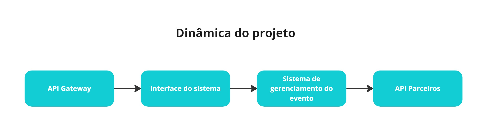
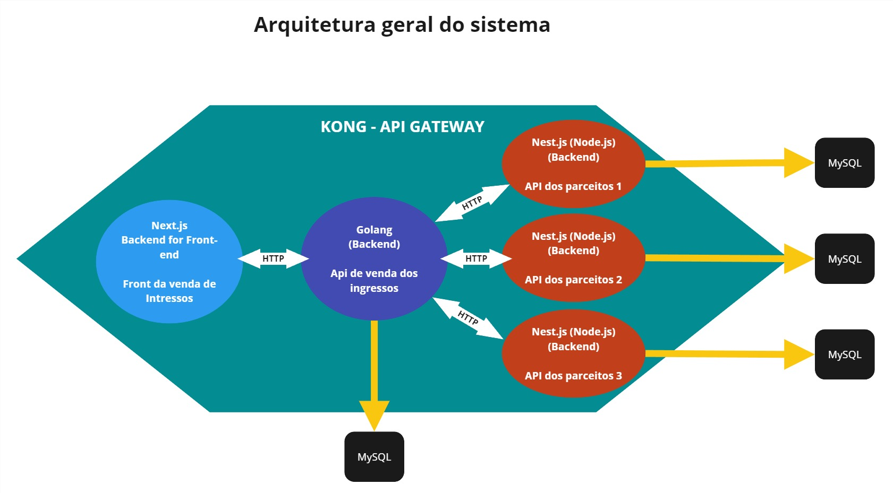
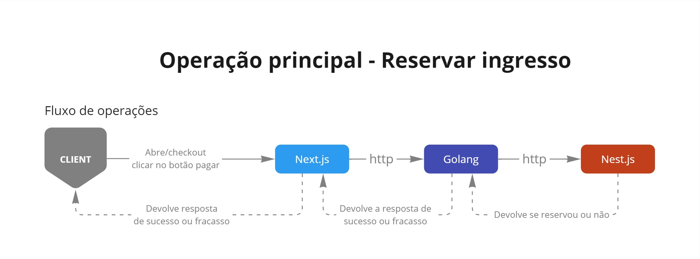
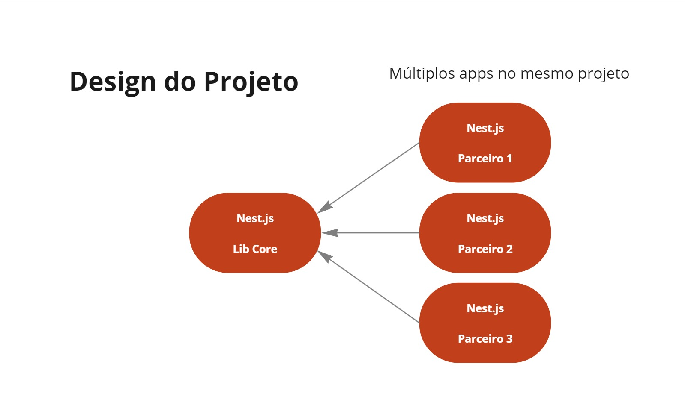
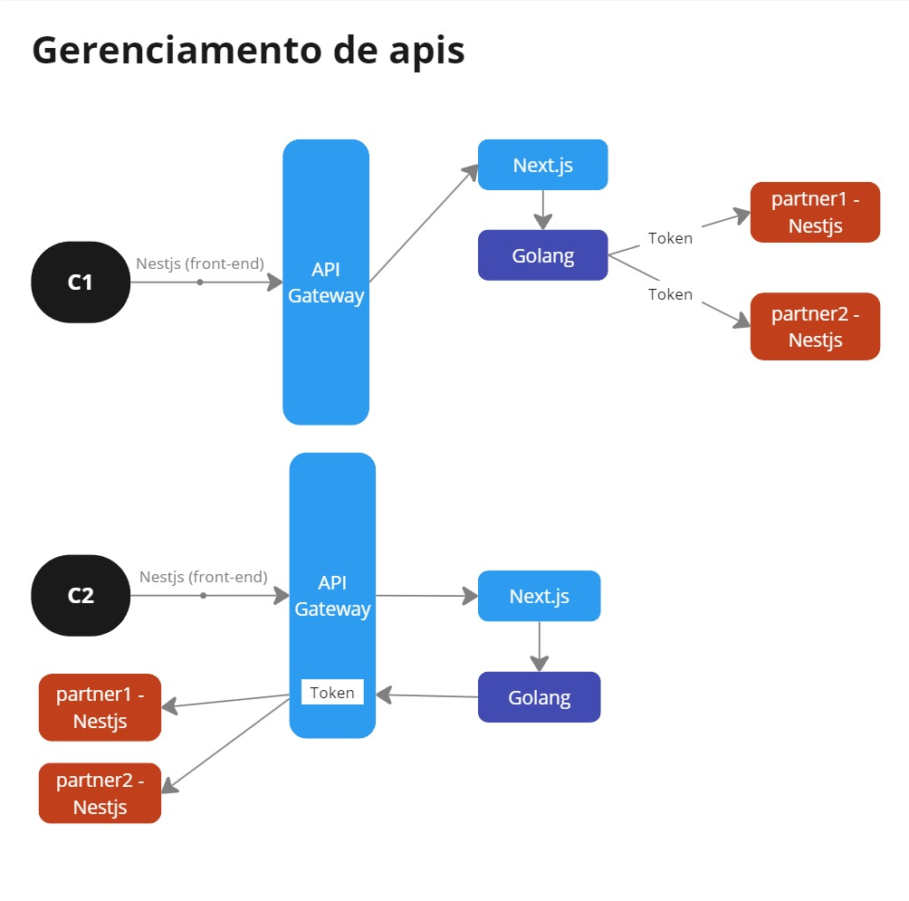

# PROJETO: Sistema de vendas de ingressos

https://github.com/devfullcycle/imersao18/tree/main

## Descrição do projeto
Desenvolvimento de um sistema completo para venda de ingressos com funcionalidades que incluem:
- Gerenciamento de Eventos: Criação, edição e exclusão de eventos.
- Processamento de Reservas: Reserva e compra de ingressos, incluindo a alocação de lugares.
- Integração com Sistemas de Parceiros: Conexão e integração com APIs de terceiros.
- Frontend: Interface amigável para usuários finais.
- API Gateway: Gestão centralizada das APIs utilizadas.

## Agenda
- Entender o Projeto Prático: Compreender os requisitos e funcionalidades do sistema.
- Tecnologias que Serão Utilizadas: Revisão das ferramentas e linguagens aplicadas no desenvolvimento.
- Ordem do Desenvolvimento: Planejamento da sequência de desenvolvimento.
- Entendimento dos Microsserviços: Estrutura e comunicação entre os microsserviços.
- Iniciar Primeiro Microsserviço: Configuração e implementação inicial.

## Dinamica do projeto



## Tecnologias
- Docker: Contêineres para consistência e portabilidade. 
- Linguagem Go: Backend robusto e escalável.
- Next.js: Frontend reativo e eficiente.
- Nest.js: Framework para desenvolvimento rápido de APIs.
- Kong API Gateway: Gestão de APIs com alto desempenho

## Cronograma de desenvolvimento
- 17/06: Api de parceiros - Nest.js
- 18/06: Api Gateway - Kong
- 19/06: Sistema de gerenciamento de integremos - Golang
- 20/06: Fontend - Next.js
- 21/06: Integração de todos os sistemas




 





## Configuração e Execução

### Docker Compose

Para iniciar o ambiente de desenvolvimento, utilize o docker-compose.yaml configurado para gerenciar os múltiplos serviços:

```yaml
#docker-compose.yaml

include:
  - golang-inbound-selling/docker-compose.yaml
  - nestjs-multitenancy/docker-compose.yaml
  - web-reactjs-with-nextjs/docker-compose.yaml
  - api-gateway-with-kong/docker-compose.with-dbless.yaml
```

Para remover todos os containers existentes:
```bash
docker rm $(docker ps -a -q)
```

Para iniciar os containers definidos:
```bash
docker compose up
```

### Acessar API Gateway com Kong

- Acesse o Kong através de:
    http://localhost:8002


### Executar Backend Golang
Acesse o container do Golang para iniciar a aplicação backend:
```bash
docker compose exec golang sh
```

Execute o servidor Golang na porta 8080:
```bash
go run cmd/events/main.go
```

### Executar Frontend com NextJS
Acesse o container do NextJS:
```bash
docker compose exec web-nextjs bash
```

Inicie a aplicação:
```bash
npm run dev
```

Acessar: 
http://host.docker.internal:3002/nextjs

### Executar Aplicação com NestJS
Acesse o container do NestJS:
```bash
docker compose exec app-nestjs bash
```

Instale as dependências necessárias:
```bash
npm install
```

Inicie o banco de dados e as migrações:
```bash
npm run migrate:partner1
npm run migrate:partner2
```

Inicie os serviços para parceiros:
```bash
npm run start partner1-fixture
npm run start partner2-fixture
```

Inicie os serviços:
```bash
npm run start start:partner1
npm run start start:partner2
```


#### Acessar o Frontend

- Acesse o frontend através dos seguintes endereços:
    http://host.docker.internal:3002/nextjs

### Acessar Kong
- Acesse o Kong através de:
    http://localhost:8002

Este projeto foi desenvolvido com foco em escalabilidade, manutenibilidade e integração eficiente com sistemas parceiros, utilizando tecnologias modernas e seguindo boas práticas de desenvolvimento.